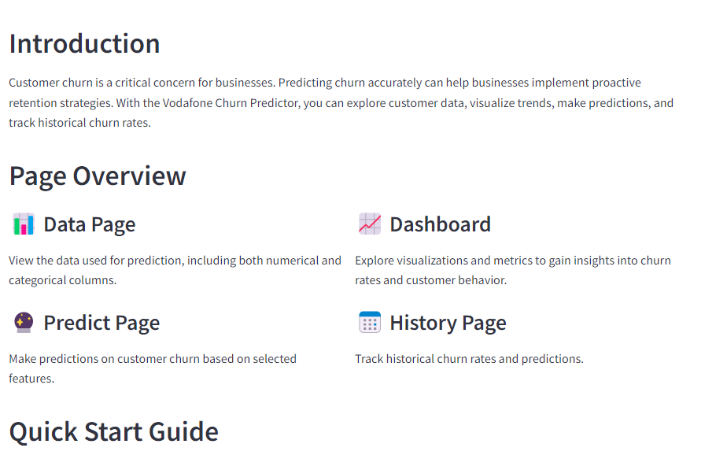

# ChurnSense: Predictive Customer Churn Application

[📗 Table of Contents](#-table-of-contents)
- [ChurnSense: Predictive Customer Churn Application](#churnsense-predictive-customer-churn-application)
  - [Churn Detector](#churn-detector)
    - [Data Features](#data-features)
  - [🛠 Built With](#-built-with)
    - [Tech Stack](#tech-stack)
  - [Core Features](#core-features)
  - [Local Setup and Usage Guide for Churn Prediction App](#local-setup-and-usage-guide-for-churn-prediction-app)
    - [Setup](#setup)
    - [Installation](#installation)
    - [Usage](#usage)
  - [👥 Authors](#-authors)
  - [🤝 Contributing](#-contributing)
  - [⭐️ Show Your Support](#️-show-your-support)
  - [🙏 Acknowledgments](#-acknowledgments)
  - [📝 License](#-license)


## Churn Detector

ChurnSense is a predictive customer churn application designed to help businesses anticipate and manage customer attrition more effectively. The primary purpose is to leverage machine learning algorithms and data analytics to forecast which customers are at risk of churning, allowing businesses to take proactive measures to retain them.

### Data Features:



**Column Descriptions:**

- **Gender:** Whether the customer is a male or a female
- **SeniorCitizen:** Whether a customer is a senior citizen or not
- **Partner:** Whether the customer has a partner or not (Yes, No)
- **Dependents:** Whether the customer has dependents or not (Yes, No)
- **Tenure:** Number of months the customer has stayed with the company
- **Phone Service:** Whether the customer has a phone service or not (Yes, No)
- **MultipleLines:** Whether the customer has multiple lines or not
- **InternetService:** Customer's internet service provider (DSL, Fiber Optic, No)
- **OnlineSecurity:** Whether the customer has online security or not (Yes, No, No Internet)
- **OnlineBackup:** Whether the customer has online backup or not (Yes, No, No Internet)
- **DeviceProtection:** Whether the customer has device protection or not (Yes, No, No internet service)
- **TechSupport:** Whether the customer has tech support or not (Yes, No, No internet)
- **StreamingTV:** Whether the customer has streaming TV or not (Yes, No, No internet service)
- **StreamingMovies:** Whether the customer has streaming movies or not (Yes, No, No Internet service)
- **Contract:** The contract term of the customer (Month-to-Month, One year, Two year)
- **PaperlessBilling:** Whether the customer has paperless billing or not (Yes, No)
- **Payment Method:** The customer's payment method (Electronic check, mailed check, Bank transfer(automatic), Credit card(automatic))
- **MonthlyCharges:** The amount charged to the customer monthly
- **TotalCharges:** The total amount charged to the customer
- **Churn:** Whether the customer churned or not (Yes or No)

## 🛠 Built With

### Tech Stack

- Python Programming Language
- Graphical User Interface (GUI)
- Machine Learning Models
- Database Integration

## Core Features

- **Data Page:** Explore the dataset used for predictions, containing both numerical and categorical columns.
- **Predict Page:** Make predictions on customer churn by selecting specific features.
- **Dashboard:** Gain insights into churn rates and customer behavior through interactive visualizations and metrics.
- **History Page:** Track historical churn rates and view past predictions for analysis and comparison.

## Local Setup and Usage Guide for Churn Prediction App

**Prerequisites:** Before running the project, ensure you have the following installed:
- Python
- Streamlit

### Setup:

1. Clone the repository to your preferred directory:

```sh
  cd my-folder
  git clone https://github.com/M-travis123/Churn-App-P4.git

  ```

  Change into the cloned repository

```sh
  cd Churn-App-P4
```

Create a virtual environment

```sh

python -m venv env

```

Activate the virtual environment

```sh
    venv/Scripts/activate
```

### Installation:

1. Install the required packages listed in the `requirements.txt` file:

```sh
   pip install -r requirements.txt
```


### Usage:

1. To run the project, execute the following command:

```sh
    streamlit run main.py

```

2. Open a web browser to view the app.
3. Log in to the app using the provided credentials.
4. Test predictions by navigating to the predictions page.

**Note:** The View Data page may be inaccessible as the secrets file is not checked into the repository.

## 👥 Authors

- Monica Nyambura

## 🤝 Contributing

We welcome contributions, issues, and feature requests. For support or inquiries, contact us at [monica.nyambura@azubiafrica.org](mailto:monica.nyambura@azubiafrica.org).

## ⭐️ Show Your Support

If you find this project helpful, consider showing your support by giving it a ⭐️ STAR ⭐️.

## 🙏 Acknowledgments

Special thanks to AzubiAfrica for making this possible.

## 📝 License

This project is licensed under the MIT License.

## Links to the article and the app 
App link = https://churnmaster-app.onrender.com
Medium Article Link = https://medium.com/@nyamburam12/title-understanding-and-utilizing-customer-churn-prediction-applications-f755bd3bc2df